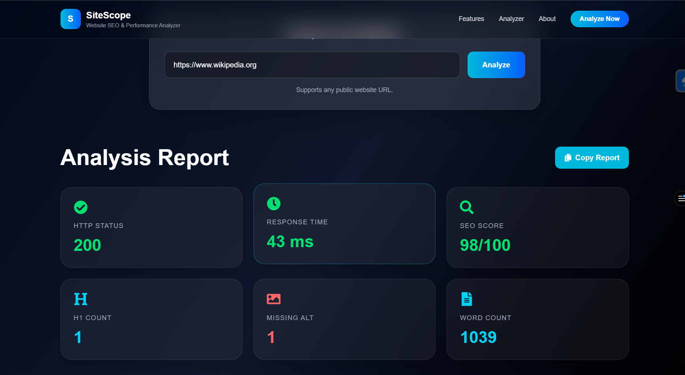
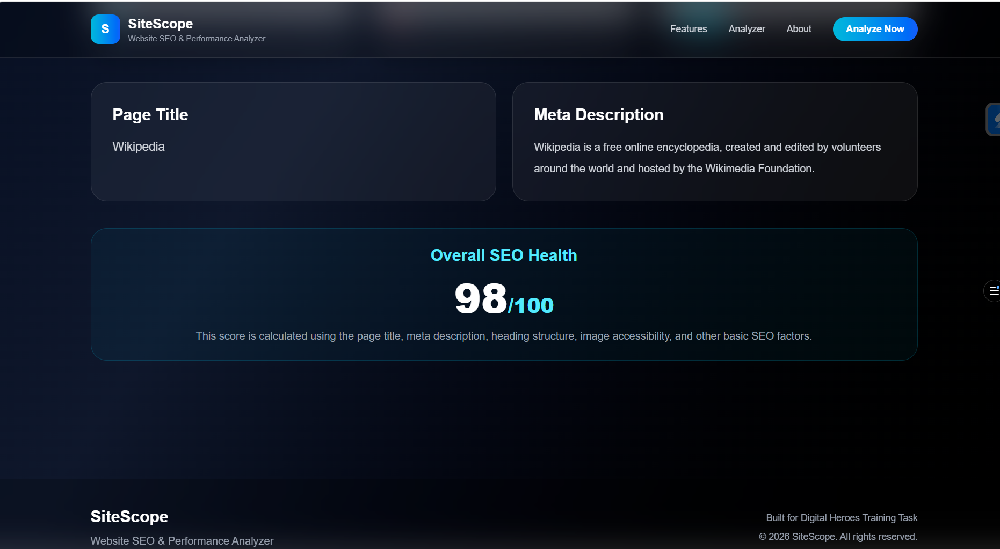

# 🚀 SiteScope - Website SEO & Performance Analyzer

SiteScope is a modern Website SEO & Performance Analyzer built using **Next.js 16**, **TypeScript**, **Tailwind CSS**, **Axios**, and **Cheerio**.

It allows users to analyze any public website URL and instantly view important SEO metrics such as HTTP Status, Response Time, SEO Score, Heading Analysis, Image Accessibility, Meta Description, and Word Count.

---

## 🌐 Live Demo

🔗 https://sitescope-seo-analyzer-seven.vercel.app/

---

## ✨ Features

- ✅ Analyze any public website
- ✅ HTTP Status Checker
- ✅ Response Time Analysis
- ✅ SEO Score Calculation
- ✅ Meta Description Detection
- ✅ Page Title Extraction
- ✅ H1 Tag Counter
- ✅ Missing ALT Attribute Detection
- ✅ Word Count Analysis
- ✅ Responsive UI
- ✅ Copy Report Button
- ✅ Beautiful Dark Theme
- ✅ Built with Next.js App Router

---

## 🛠 Tech Stack

- Next.js 16
- React
- TypeScript
- Tailwind CSS
- Axios
- Cheerio
- React Icons
- Vercel

---

# 📸 Project Preview

## 🏠 Home Page


---

## 📊 Analysis Report



---

## 📈 SEO Health Report



---

# 📁 Project Structure

```
sitescope-seo-analyzer
│
├── app
│   ├── api
│   ├── components
│   ├── globals.css
│   ├── layout.tsx
│   └── page.tsx
│
├── lib
│   └── analyzer.ts
│
├── public
│
├── assets
│   ├── home.png
│   ├── report1.png
│   └── report2.png
│
├── package.json
├── tsconfig.json
└── README.md
```

---

# ⚙️ Installation

Clone the repository

```bash
git clone https://github.com/Prerna1315/sitescope-seo-analyzer.git
```

Move into the project

```bash
cd sitescope-seo-analyzer
```

Install dependencies

```bash
npm install
```

Run development server

```bash
npm run dev
```

Open

```
http://localhost:3000
```

---

# 📊 SEO Metrics Included

- HTTP Status
- Response Time
- SEO Score
- Page Title
- Meta Description
- H1 Count
- Missing ALT Images
- Word Count

---

# 🚀 Deployment

This project is deployed on **Vercel**.

Live URL

https://sitescope-seo-analyzer-seven.vercel.app/

---

# 👩‍💻 Author

**Prerna Revalia**

GitHub

https://github.com/Prerna1315

---

# 📄 License

This project is developed for educational and portfolio purposes.
